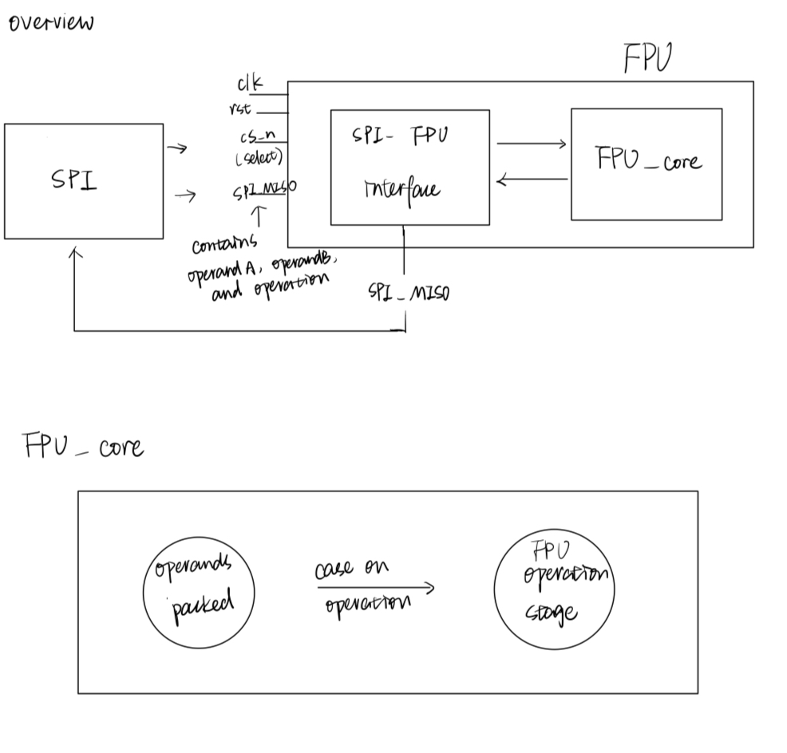

# 18-224/624 S25 Tapeout Template

1. Add your verilog source files to `source_files` in `info.yaml`. The top level of your chip should remain in `chip.sv` and be named `my_chip`

  
  

2. Optionally add other details about your project to `info.yaml` as well (this is only for GitHub - your final project submission will involve submitting these in a different format)

3. Do NOT edit `toplevel_chip.v`  `config.tcl` or `pin_order.cfg`

 # Final Project Submission Details 
  
1. Your design must synthesize at 30MHz but you can run it at any arbitrarily-slow frequency (including single-stepping the clock) on the manufactured chip. If your design must run at an exact frequency, it is safest to choose a lower frequency (i.e. 5MHz)

  

2. For your final project, we will ask you to submit some sort of testbench to verify your design. Include all relevant testing files inside the `testbench` repository

  
  

3. For your final project, we will ask you to submit documentation on how to run/test your design, as well as include your project proposal and progress reports. Include all these files inside the `docs` repository

  
  

4. Optionally, if you use any images in your documentation (diagrams, waveforms, etc) please include them in a separate `img` repository

  

5. Feel free to edit this file and include some basic information about your project (short description, inputs and outputs, diagrams, how to run, etc). An outline is provided below

 # Floating-Point Arithmetic Unit

## SPI-Based Floating-Point Arithmetic Unit (FPU)

This project implements a hardware-accelerated Floating-Point Arithmetic Unit (FPU) following the IEEE-754 single-precision (32-bit) standard. The FPU receives two floating-point numbers and an operation code over an SPI interface, performs the computation in hardware, and returns the result through SPI.

Supported operations:  
    - Addition  
    - Subtraction  
    - Multiplication  
    - Division  

## Block Diagram

The FPU is integrated inside a top-level wrapper called my_chip, using a 12-bit IO interface.

## IO

An IO table

| Input/Output | Description |
|--------------|----------------------------------------------------|
| io_in[0]     | SPI clock (`SCLK`) — serial clock from SPI master  |
| io_in[1]     | SPI chip-select (`CS_N`) — active low              |
| io_in[2]     | SPI master-out-slave-in (`MOSI`) — data from master|
| io_in[11:3]  | Unused                                             |
| io_out[0]    | SPI master-in-slave-out (`MISO`) — data to master  |
| io_out[11:1] | Unused                                             |   

## How to Test

## Simulation Testing (Pre-Silicon)
Simulate using Verilator + Cocotb  
Run the Cocotb testbench for SPI and main_test  
Verify that addition, subtraction, multiplication, and division operations produce correct results

### Structure

The `testbench/` folder includes individual unit tests for each part of the FPU:

| Testbench        | Module tested           | Purpose｜
|------------------|-------------------------|---------------------------------|
| `add_test.py`    | `fp_adder`              | Test floating-point addition    |
| `sub_test.py`    | `fp_sub`                | Test floating-point subtraction |
| `mul_test.py`    | `fp_mult`               | Test floating-point mult        |
| `SPI_test.py`    | `fpu_spi`               | Test SPI shift-in/shift-out     |
| `main_test.py`   | `fpu_spi` (Test Mode)   | Full end-to-end functional test |

Each testbench has its own corresponding Makefile:
- `adder.mk`, `sub.mk`, `mul.mk`, `SPI.mk`, `main.mk`

### How to Run Each Simulation

**Example to run addition test:**
make -Bf adder.mk

Successful simulation will show PASS.

# Post-Layout (Post-Tapeout) Testing
Once the design is fabricated, I will validate the functionality via an external SPI master device.

Hardware Setup
Inputs:  
Connect io_in[0] to SPI SCLK  
Connect io_in[1] to SPI CS_N (active-low chip select)  
Connect io_in[2] to SPI MOSI (master output, slave input)  

Outputs:  
Read io_out[0] from SPI MISO (slave output)  
Other pins (io_in[11:3] and io_out[11:1]) are unused.  

Clock and Reset:  
Provide the clock input (system clock).  
Assert reset high to clear internal states.

# SPI Communication Protocol

Transaction Format:
| Field	   | Width   | Description|
|----------|---------|-------------------------------------------------|
| Opcode   | 2 bits	 | Operation code (00=ADD, 01=SUB, 10=MUL, 11=DIV) |
| Operand A| 32 bits | IEEE-754 32-bit floating-point operand A        |
| Operand B| 32 bits | IEEE-754 32-bit floating-point operand B        |

