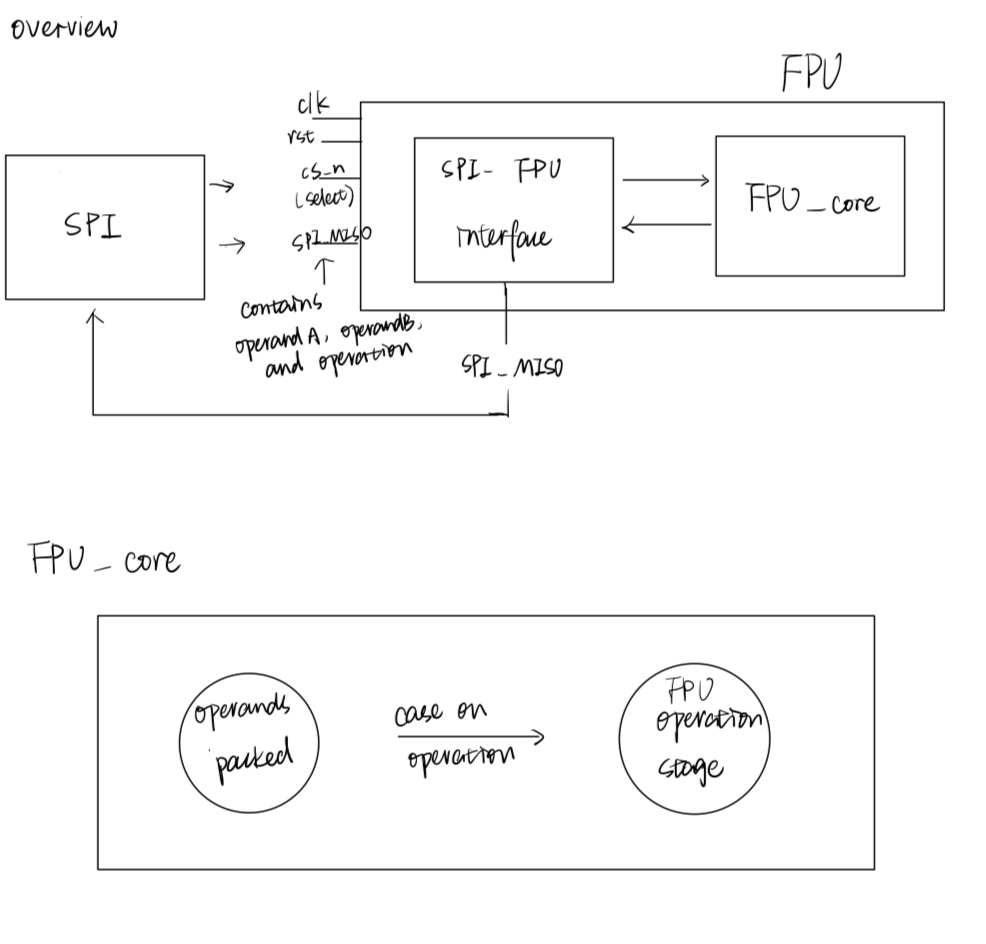

# Floating-Point Arithmetic Unit

## SPI-Based Floating-Point Arithmetic Unit (FPU)

This project implements a hardware-accelerated Floating-Point Arithmetic Unit (FPU) following the IEEE-754 single-precision (32-bit) standard. The FPU receives two floating-point numbers and an operation code over an SPI interface, performs the computation in hardware, and returns the result through SPI.

Supported operations:
    - Addition
    - Subtraction
    - Multiplication
    - Division

## Block Diagram

The FPU is integrated inside a top-level wrapper called my_chip, using a 12-bit IO interface.

## IO

An IO table

| Input/Output | Description |
|--------------|----------------------------------------------------|
| io_in[0]     | SPI clock (`SCLK`) — serial clock from SPI master  |
| io_in[1]     | SPI chip-select (`CS_N`) — active low              |
| io_in[2]     | SPI master-out-slave-in (`MOSI`) — data from master|
| io_in[11:3]  | Unused                                             |
| io_out[0]    | SPI master-in-slave-out (`MISO`) — data to master  |
| io_out[11:1] | Unused                                             |   

## How to Test

## Simulation Testing (Pre-Silicon)
Simulate using Verilator + Cocotb
Run the Cocotb testbench for SPI and main_test
Verify that addition, subtraction, multiplication, and division operations produce correct results

### Structure

The `testbench/` folder includes individual unit tests for each part of the FPU:

| Testbench        | Module tested           | Purpose                         ｜
|------------------|-------------------------|---------------------------------|
| `add_test.py`    | `fp_adder`              | Test floating-point addition    |
| `sub_test.py`    | `fp_sub`                | Test floating-point subtraction |
| `mul_test.py`    | `fp_mult`               | Test floating-point mult        |
| `SPI_test.py`    | `fpu_spi`               | Test SPI shift-in/shift-out     |
| `main_test.py`   | `fpu_spi` (Test Mode)   | Full end-to-end functional test |

Each testbench has its own corresponding Makefile:
- `adder.mk`, `sub.mk`, `mul.mk`, `SPI.mk`, `main.mk`

### How to Run Each Simulation

**Example to run addition test:**
make -Bf adder.mk

Successful simulation will show PASS.

# Post-Layout (Post-Tapeout) Testing
Once the design is fabricated, O can validate the functionality via an external SPI master device.

Hardware Setup
Inputs:
Connect io_in[0] to SPI SCLK
Connect io_in[1] to SPI CS_N (active-low chip select)
Connect io_in[2] to SPI MOSI (master output, slave input)

Outputs:
Read io_out[0] from SPI MISO (slave output)
Other pins (io_in[11:3] and io_out[11:1]) are unused.

Clock and Reset:
Provide the clock input (system clock).
Assert reset high to clear internal states.

# SPI Communication Protocol

Transaction Format:
Field	    Width	 Description
Opcode	    2 bits	 Operation code (00=ADD, 01=SUB, 10=MUL, 11=DIV)
Operand A	32 bits	 IEEE-754 32-bit floating-point operand A
Operand B	32 bits	 IEEE-754 32-bit floating-point operand B